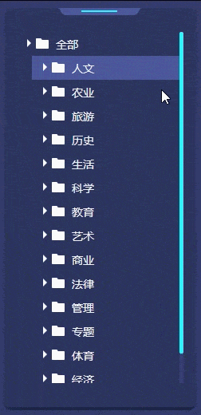

**大部分需求使用系统默认的滚动条就行了，可有时候有些特殊的需求就需要写一个模拟的滚动条了。既然遇到了这个需求，就记录一下，避免下次还要从头写。**   
**时间不太够，就没有封装。**

**计算滚动条滚动距离部分真是算了好久才理清楚。**

**效果如下：**   


```javascript
  // html 
  <div class="container" onselectstart="return false">
    <div class="content-box">
      <div class="content">
        <p>
          Promise 是异步编程的一种解决方案，比传统的解决方案——回调函数和事件——更合理和更强大。
          它由社区最早提出和实现，ES6 将其写进了语言标准，统一了用法，原生提供了Promise对象。
          所谓Promise，简单说就是一个容器，里面保存着某个未来才会结束的事件（通常是一个异步操作）的结果。
          从语法上说，Promise 是一个对象，从它可以获取异步操作的消息。Promise 提供统一的 API，各种异步操作都可以用同样的方法进行处理。

          Promise对象有以下两个特点。
          （1）对象的状态不受外界影响。
          Promise对象代表一个异步操作，有三种状态：pending（进行中）、fulfilled（已成功）和rejected（已失败）。
          只有异步操作的结果，可以决定当前是哪一种状态，任何其他操作都无法改变这个状态。
          这也是Promise这个名字的由来，它的英语意思就是“承诺”，表示其他手段无法改变。
          （2）一旦状态改变，就不会再变，任何时候都可以得到这个结果。
          Promise对象的状态改变，只有两种可能：从pending变为fulfilled和从pending变为rejected。
          只要这两种情况发生，状态就凝固了，不会再变了，会一直保持这个结果，这时就称为 resolved（已定型）。
          如果改变已经发生了，你再对Promise对象添加回调函数，也会立即得到这个结果。
          这与事件（Event）完全不同，事件的特点是，如果你错过了它，再去监听，是得不到结果的。
        </p>
      </div>
    </div>
    <div class="scroll-box">
      <div class="scroll-bar">

      </div>
    </div>
  </div>
  
  // css
  .container {
      position: relative;
      width: 300px;
      height: 400px;
      margin: auto;
      border: 1px solid #E3E3E3;
      box-shadow: 0 0 10px #E3E3E3;
      padding: 10px;
    }
    .content-box {
      position: relative;
      overflow: hidden;
      width: 100%;
      height: 100%;
    }
    .content {
      position: absolute;
      top: 0;
      left: 0;
    }
    p {
      margin: 0;
    }
    .scroll-box {
      position: absolute;
      right: 0;
      top: 0;
      width: 3px;
      height: 100%;
      background-color: #FFFFFF;
      border-radius: 10px;
      opacity: 0;
    }
    .scroll-bar {
      width: 100%;
      height: 60px;
      background-color: #474747;
      border-radius: 10px;
      cursor: pointer;
      position: absolute;
      transition: height .5s;
    }
  
  // script
  class Common {
    constructor() {}
    // 兼容获取scrollLeft/scrollTop
    getScroll() {
      const scrollLeft = document.body.scrollLeft || document.documentElement.scrollLeft;
      const scrollTop = document.body.scrollTop || document.documentElement.scrollTop;
      return {
        scrollLeft: scrollLeft,
        scrollTop: scrollTop
      }
    }
    // 兼容获取pageX/pageY
    getPage(e) {
      const pageX = e.pageX || e.clientX + getScroll().scrollLeft;
      const pageY = e.pageY || e.clientY + getScroll().scrollTop;
      return {
        pageX: pageX,
        pageY: pageY
      }
    }
    getByClass(c) {
      return document.getElementsByClassName(c)
    }
  }
  class ScrollBar extends Common {
    constructor() {
      super();
    }
    getDom() {
      this.box = this.getByClass('container')[0];
      this.content = this.getByClass('content')[0];
      this.scroll = this.getByClass('scroll-box')[0];
      this.bar = this.getByClass('scroll-bar')[0];
      this.boxHeight = this.box.clientHeight - 20;
      this.top = 0;
      this.barTop = 0;
      // 每次滚动像素
      this.delta = 20;
    }
    _scroll() {
      this.getDom();
      this.content.style.top = 0;

      // 当内容的高度大于盒子的高度时,显示滚动条
      if (this.content.scrollHeight > this.boxHeight) {
        //		滚动条高度 = 盒子高度 / 内容高度 * 滚动盒子高度
        //	==> 滚动条高度 / 滚动盒子高度 = 盒子高度 / 内容高度
        this.bar.style.height = this.boxHeight / this.content.scrollHeight * this.scroll.clientHeight + 'px';
        this.scroll.style.opacity = 1;
      } else {
        this.scroll.style.opacity = 0;
      }

      this.bar.onmousedown = e => this.mouseDown.call(this);
      document.onmouseup = function() {
          document.onmousemove = null;
      }

      this.mouseScroll()
    }
    mouseDown(e) {
      e = e || window.event;
      const y = this.getPage(e).pageY - this.bar.offsetTop;
      document.onmousemove = e => this.mouseMove.call(this, e, y)
    }
    mouseMove(e, y) {
      /* 滚动时鼠标点击的位置是不变的.盒子和顶部的距离也是固定的.
      鼠标位于滚动条的位置 = 起始鼠标位置(e.pageY) - 滚动条起始滚动的距离(bar.offsetTop) - 盒子和顶部的距离(固定值)
      滚动距离 = 终止鼠标位置(e.pageY) - 鼠标位于滚动条的位置 - 盒子和顶部的距离(固定值)
      上面两个表达式合并: 滚动距离 = 终止鼠标位置(e.pageY) - 起始鼠标位置(e.pageY) + 滚动条起始滚动的距离(bar.offsetTop) */
      // sh：滚动条最大可滚动距离, ch:内容最大可滚动距离
      const sh = this.scroll.clientHeight - this.bar.clientHeight, ch = this.content.scrollHeight - this.boxHeight;
      // 计算滚动条滚动距离
      let barY = this.getPage(e).pageY - y;
      // 小于0时赋值为0,大于0等于本身
      barY = barY < 0 ? 0 : barY;
      // 大于最大可滚动距离时重新赋值为sh,否则赋值为本身
      barY = barY > sh ? sh : barY;
      this.bar.style.top = barY + 'px';
      // 当前滚动条滚动距离 / 滚动条最大滚动距离  = 当前内容滚动距离 / 内容最大可滚动距离
      var contentY = barY / sh * ch;
      this.content.style.top = -contentY + "px";
    }
    mouseScroll() {
      //Safari与Chrome属于同一类型
      this.box.onmousewheel = e => this.scrollFunc.call(this, e);
      /*IE、Opera注册事件*/
      if(document.attachEvent) {
          this.box.attachEvent('onmousewheel', e => this.scrollFunc.call(this, e));
      } else if(document.addEventListener) {
        //Firefox使用addEventListener添加滚轮事件  
        this.box.addEventListener('DOMMouseScroll', e => this.scrollFunc.call(this, e), false);
      }
    }
    scrollFunc(e) {
      e = e || window.event;
      if (e.preventDefault) {
          e.preventDefault();
      } else{
          e.returnValue = false;
      }
      if (e.wheelDelta) {
        if (e.wheelDelta > 0) {
          // 上滚中...
          this.toUp()
        }
        if (e.wheelDelta < 0) {
          // console.log('下滚中...');
          this.toDown()
        }
        this.bar.style.top = this.barTop + "px";
        this.content.style.top = this.top + "px";
      } else {
        if (e.detail> 0) { 
          //当滑轮向下滚动时
          this.toDown()
        }  
        if (e.detail< 0) {
          //当滑轮向上滚动时  
          this.toUp()
        } 
        this.bar.style.top = this.barTop + "px";
        this.content.style.top = this.top + "px";
      }
    }
    toUp() {
      const sh = this.scroll.clientHeight - this.bar.clientHeight, ch = this.content.scrollHeight - this.boxHeight;
      this.top = parseInt(this.content.style.top) + this.delta;
      this.barTop = Math.abs(this.top) * sh / ch
      if (this.top >= 0) {
        this.top = 0;
        this.barTop = 0
      }
    }
    toDown() {
      const sh = this.scroll.clientHeight - this.bar.clientHeight, ch = this.content.scrollHeight - this.boxHeight;
      this.top = parseInt(this.content.style.top) - this.delta;
      this.barTop = Math.abs(this.top) * sh / ch;
      if (Math.abs(this.top) >= ch) {
        this.top = -ch;
        this.barTop = Math.abs(this.top) * sh / ch
      }
    }
  }
  var s = new ScrollBar();
  s._scroll()
```
